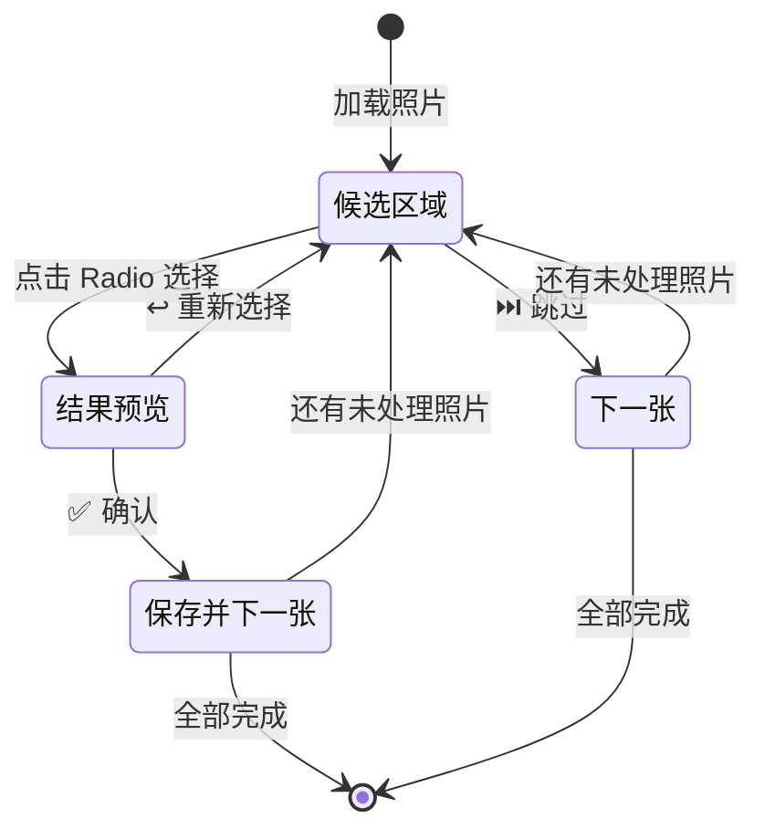

# 标注工具用户手册

Gradio Web UI，用于生成拼板检测模型的训练数据。通过 FastSAM 自动分割 + 人工确认的方式，快速构建 YOLO 分割数据集。

> [!tip] 核心思路
> FastSAM 自动识别照片中的多个区域，你只需要选出**哪个区域是拼板**。选中的结果作为训练数据，教会 AI 自动识别拼板位置。

## 启动

```bash
python src/label_ui.py    # 浏览器打开 http://localhost:7860
```

## ① 上传照片

| 操作 | 说明 |
|------|------|
| 选择文件 | 拖拽或点击选择多张拼板照片（支持 JPG、PNG） |
| 点击「📤 上传」 | 照片复制到 `training/photos/`，页面显示缩略图预览 |
| 点击「▶ 开始标注」 | 进入下一步（上传至少 1 张后激活） |

> [!info] 照片要求
> 照片应包含完整的拼板区域，背景相对干净效果最佳。支持多张照片批量上传。

## ② 标注确认

这是核心标注流程，采用 **选择 → 预览 → 确认/重选** 三步操作：



### 操作步骤

1. **点击「▶ 开始标注」** — 自动对所有照片运行 FastSAM 分割
2. **查看候选区域** — 照片上用不同颜色的半透明遮罩标记最多 10 个候选区域，每个区域有编号标签
3. **点击 Radio 选择** — 右侧显示候选列表（如 `#0 面积 45.2%`），点击选择你认为正确的拼板区域
4. **预览确认** — 选择后显示绿色轮廓预览，可以：
   - **✅ 确认，下一张** — 保存标签，自动跳转到下一张未处理照片
   - **↩️ 重新选择** — 返回候选区域列表重新选择
5. **⏭️ 跳过这张** — 不标注当前照片，跳到下一张

### 进度显示

页面顶部显示标注进度：

```
进度：3 已标注，1 跳过，共 10 张
✅ photo1.jpg  |  ✅ photo2.jpg  |  🟡 photo3.jpg  |  ⏭️ photo4.jpg
```

图标含义：✅ 已标注 | 🟡 待处理 | ⏭️ 已跳过

### 导出数据集

全部照片处理完成后（或随时）点击 **「📦 导出数据集」**，生成报告：

```
📊 数据集统计

照片总数：10
已标注：7
跳过：3

训练图片：7
训练标签：7

数据集路径：training/dataset
配置文件：training/dataset/data.yaml

下一步 — 训练模型：
  python training/train.py --data training/dataset/data.yaml
```

### 数据集格式

输出 YOLO 分割格式，存放在 `training/dataset/`：

```
training/dataset/
├── data.yaml           # 数据集配置（自动生成）
├── images/
│   ├── train/          # 训练图片（原图副本）
│   └── valid/          # 验证图片（需手动划分）
└── labels/
    ├── train/          # YOLO 分割标签
    └── valid/          # 验证标签
```

标签格式：`class x1 y1 x2 y2 ...`（归一化坐标），详见 [[training-pipeline#数据集格式]]。

## 故障排查

> [!warning] FastSAM 模型未找到
> 确保 `FastSAM-s.pt` 文件在项目根目录。该文件已在 `.gitignore` 中豁免。

> [!warning] 没有候选区域
> 照片中可能没有足够矩形特征的区域。尝试拍摄更清晰的拼板照片，确保拼板占据画面主要部分。

> [!tip] 提升标注效率
> 先批量上传所有照片，然后一次性完成标注。FastSAM 分割只在点击「开始标注」时运行一次，之后切换照片不需要重新分割。

## 关联文档

- [[product-overview]] — 产品功能概述
- [[training-pipeline]] — 用标注数据训练模型
- [[architecture]] — 标注服务的技术实现（`src/label_service.py`）
