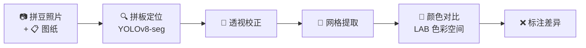

# Pintconut — 拼豆差异检测器

> [!info] 一句话说明
> 比较拼豆作品照片与图纸，自动检测并标注拼错的位置。

## 核心工作流



5 个阶段依次执行：

1. **拼板定位** — YOLOv8-seg（迁移学习）从照片中定位拼板区域
2. **透视校正** — 将倾斜的拼板校正为标准矩形
3. **网格提取** — 按拼板尺寸等分为网格，每格采样中心区域颜色
4. **颜色对比** — 在 LAB 色彩空间逐格对比照片与图纸（20 色盘，可扩展到 221 色）
5. **标注差异** — 在照片上用红框 + 红叉标记拼错的位置

## 使用方式

### 方式一：命令行检测差异

```bash
python -m src.cli \
  --photo photo.jpg \
  --blueprint blueprint.png \
  --board-size 29x29 \
  --model models/beadboard-best.pt \
  --output result.jpg
```

#### 参数说明

| 参数 | 必填 | 说明 |
|------|------|------|
| `--photo` | ✅ | 拼豆照片路径 |
| `--blueprint` | 否 | 图纸图片路径 |
| `--board-size` | 否 | 拼板尺寸，格式 `ROWSxCOLS`（如 `29x29`） |
| `--model` | 否 | 拼板检测模型路径（默认 `models/beadboard-best.pt`） |
| `--bead-model` | 否 | 豆子检测模型路径（默认 `models/bead-best.pt`） |
| `--output` | 否 | 输出图片路径（默认 `annotated_result.jpg`） |
| `--color-tolerance` | 否 | 颜色匹配容差 LAB 距离（默认 `30.0`） |

> [!warning] 前置条件
> 需要先训练模型。参见 [[training-pipeline]]。

### 方式二：Gradio Web UI 标注工具

用于生成拼板检测训练数据的 Web 界面。详见 [[labeling-tool-guide]]。

```bash
python src/label_ui.py    # http://localhost:7860
```

### 方式三：豆子标注工具

用于生成豆子级别检测训练数据。

```bash
python src/bead_annotate_ui.py    # http://localhost:7860
```

## 拼板尺寸

内置 6 种常见规格（定义在 `data/board_sizes.json`）：

| 名称 | 尺寸 | 用途 |
|------|------|------|
| Square Mini | 14×14 | 小型作品 |
| Square Small | 21×21 | 常规作品 |
| Square Medium | 29×29 | 标准作品 |
| Square Large | 40×40 | 大型作品 |
| Rectangle Small | 21×29 | 长方形作品 |
| Rectangle Large | 29×58 | 超长作品 |

## 色盘

当前定义了 20 种颜色（`data/colors.json`），包含 White、Black、Red、Blue、Green 等基础色。颜色匹配在 [[architecture#颜色系统|LAB 色彩空间]] 中进行。

## 关联文档

- [[labeling-tool-guide]] — 标注工具完整操作手册
- [[architecture]] — 技术架构和模块设计
- [[training-pipeline]] — 模型训练全流程
