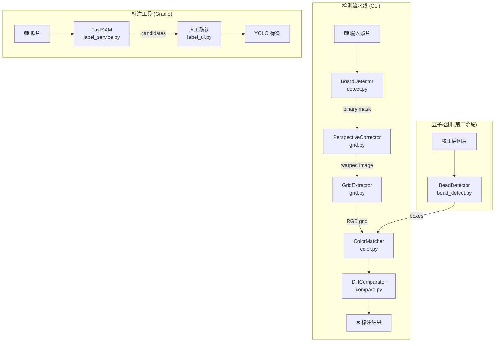
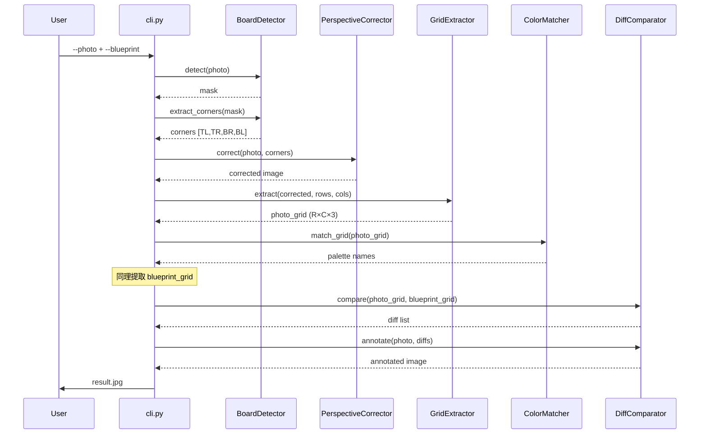

# 架构设计

## 系统架构



## 核心模块

### BoardDetector (`src/detect.py`)

拼板定位模块，使用 YOLOv8-seg 迁移学习模型。

| 方法 | 说明 | 返回 |
|------|------|------|
| `detect(image)` | 检测拼板区域 | 二值 mask 或 `None` |
| `extract_corners(mask)` | 从 mask 提取 4 个角点 | `[TL, TR, BR, BL]` 或 `None` |

角点排序算法：按 `x+y` 和 `y-x` 的极值定位四个方向角。

### PerspectiveCorrector (`src/grid.py`)

透视校正，将倾斜的拼板变换为标准矩形。

| 方法 | 说明 | 返回 |
|------|------|------|
| `correct(image, corners, output_size)` | 透视变换 | 校正后图像 |

使用 `cv2.getPerspectiveTransform` + `cv2.warpPerspective`。

### GridExtractor (`src/grid.py`)

从校正后图像中提取颜色网格。

| 方法 | 说明 | 返回 |
|------|------|------|
| `extract(board_image, rows, cols, sample_fraction)` | 逐格采样 | `(rows, cols, 3)` RGB 数组 |

每格取中心区域（默认 40%）的中位颜色，避免边缘干扰。

### ColorMatcher (`src/color.py`)

颜色匹配模块，在 LAB 色彩空间工作。

| 方法 | 说明 | 返回 |
|------|------|------|
| `match(rgb)` | 找最近色盘颜色 | `{id, name, rgb}` |
| `is_bead(rgb, threshold)` | 判断是否为豆子（vs 空板） | `bool` |
| `match_grid(rgb_grid)` | 批量匹配整个网格 | `(rows, cols)` 对象数组 |
| `match_box(img, box)` | 从检测框中心采样匹配 | `{color_name, rgb, is_bead, confidence}` |

### DiffComparator (`src/compare.py`)

差异对比和标注模块。

| 方法 | 说明 | 返回 |
|------|------|------|
| `compare(photo_grid, blueprint_grid)` | 逐格对比 | `[{row, col, type, colors}]` |
| `annotate(photo, diffs, rows, cols)` | 在照片上绘制差异 | 标注后图像 |

### BeadDetector (`src/bead_detect.py`)

豆子级别检测模块，使用 YOLOv8n 模型。

| 方法 | 说明 | 返回 |
|------|------|------|
| `detect(img)` | YOLO 推理 | `[{xyxy, conf, width, height, cx, cy}]` |
| `filter_boxes(boxes, ...)` | 按置信度/尺寸/mask 过滤 | 过滤后的 boxes |
| `detect_beads(img, color_matcher, board_mask)` | 完整流水线：检测→过滤→配色 | 带 color_name 的 boxes |
| `count_beads(beads)` | 统计颜色分布 | `{total, by_color}` |

过滤策略：以中位宽度为基准，保留 0.3×~3× 范围内的检测框。

### 标注服务 (`src/label_service.py`)

FastSAM 半自动标注核心逻辑。

| 方法 | 说明 |
|------|------|
| `segment_image(image, model)` | FastSAM 分割，返回最多 10 个矩形候选区域 |
| `draw_candidates(image, candidates)` | 绘制带编号的半透明候选区域（碰撞避免标签） |
| `draw_result(image, mask)` | 绘制选中结果的绿色轮廓预览 |
| `save_label(mask, image_path, ...)` | 保存 YOLO 分割标签 |
| `generate_dataset_yaml(dataset_dir)` | 生成 `data.yaml` 配置文件 |

候选筛选：面积 5%~95% + 矩形度 > 0.5（mask 面积 / 凸包面积）。

## 数据流

完整的差异检测流水线：



## 颜色系统

颜色匹配使用 CIE LAB 色彩空间，通过 `cv2.cvtColor(pixel, cv2.COLOR_RGB2Lab)` 转换。

**匹配算法**：计算输入颜色与色盘中所有颜色的欧氏距离，取最小距离的色盘颜色。

**豆子判断**（`is_bead`）：
1. 亮度 < 100 → 认为是豆子（深色物体）
2. 否则计算与白色板面 `[250, 250, 250]` 的 LAB 距离
3. 距离 > threshold（默认 30）→ 是豆子

> [!info] BGR vs RGB 约定
> 图像在流水线中始终使用 OpenCV 的 **BGR** 格式。只有在颜色匹配（`ColorMatcher`）和 Gradio 显示时才转换为 RGB。`ColorMatcher.match_box()` 内部处理 BGR→RGB 转换。

## 设计模式

### Lazy Model Loading

`BoardDetector`、`BeadDetector` 和 label UI 中的 FastSAM 都采用延迟加载：

```python
def _load_model(self):
    if self.model is None:
        from ultralytics import YOLO
        self.model = YOLO(self.model_path)
```

原因：模型文件（`*.pt`）体积大且被 `.gitignore` 排除。延迟加载避免导入时找不到模型文件导致崩溃。

### 模块级单例

`label_ui.py` 使用模块级字典管理 Gradio 回调间的状态：

- `_segmentation_cache` — 图片路径 → 候选区域列表
- `_annotation_state` — 图片路径 → `"labeled"` / `"skipped"` / `None`
- `_pending_selection` — 图片路径 → 用户选中的候选索引

### 角点排序

`BoardDetector._order_corners()` 使用数学性质排序：
- `x+y` 最小 → 左上角
- `y-x` 最小 → 右上角
- `x+y` 最大 → 右下角
- `y-x` 最大 → 左下角

## 文件结构

```
src/
├── cli.py              # CLI 入口，编排完整流水线
├── detect.py           # BoardDetector — 拼板检测 + 角点提取
├── grid.py             # PerspectiveCorrector + GridExtractor
├── color.py            # ColorMatcher — 20 色盘 LAB 匹配
├── blueprint.py        # parse_blueprint — 图纸网格提取
├── compare.py          # DiffComparator — 差异对比 + 标注
├── bead_detect.py      # BeadDetector — YOLOv8n 豆子检测
├── bead_prelabel.py    # HoughCircles 预标注 → YOLO 检测格式
├── label_service.py    # FastSAM 标注核心逻辑
├── label_ui.py         # Gradio 2-tab 标注向导
└── bead_annotate_ui.py # Gradio 豆子标注工具

data/
├── colors.json         # 20 色盘定义 {id, name, rgb}
└── board_sizes.json    # 6 种拼板尺寸规格

tests/
├── conftest.py         # Playwright Gradio server fixture
├── test_detect.py      # BoardDetector 单元测试
├── test_grid.py        # 透视校正 + 网格提取测试
├── test_color.py       # ColorMatcher 测试
├── test_blueprint.py   # 图纸解析测试
├── test_compare.py     # 差异对比测试
├── test_bead_detect.py # BeadDetector 测试
├── test_bead_prelabel.py # HoughCircles 测试
├── test_label_service.py # 标注服务测试
└── test_label_ui_integration.py # Playwright E2E 测试
```

## 关联文档

- [[product-overview]] — 产品功能概述
- [[labeling-tool-guide]] — 标注工具用户手册
- [[training-pipeline]] — 训练流水线
