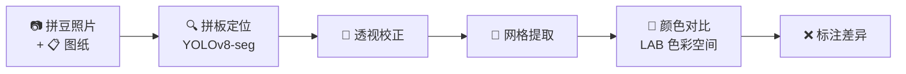
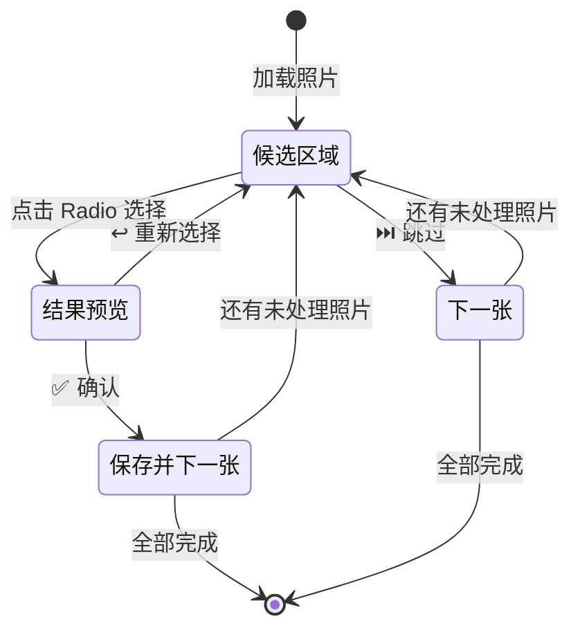
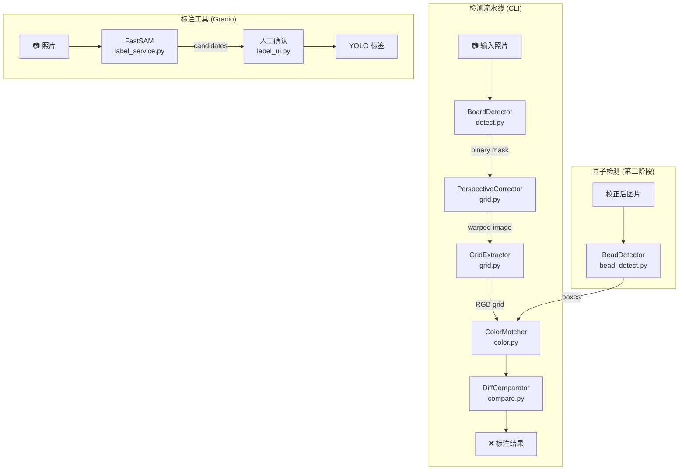
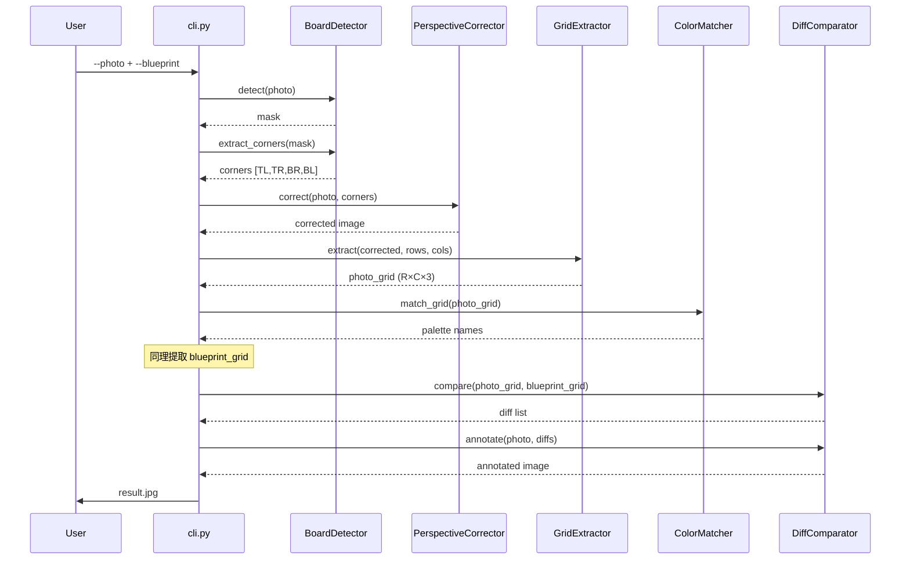

# Obsidian Documentation Implementation Plan

> **For agentic workers:** REQUIRED SUB-SKILL: Use superpowers:subagent-driven-development (recommended) or superpowers:executing-plans to implement this plan task-by-task. Steps use checkbox (`- [ ]`) syntax for tracking.

**Goal:** Create 4 Obsidian-flavored documentation files for Pintconut covering product overview, labeling tool guide, architecture, and training pipeline.

**Architecture:** 4 markdown files under `docs/obs/{product,technical}/` using Obsidian frontmatter, wikilinks, callouts, and Mermaid diagrams. Content derived from source code reading.

**Tech Stack:** Obsidian Flavored Markdown, Mermaid diagrams

---

### Task 1: Create product-overview.md

**Files:**
- Create: `docs/obs/product/product-overview.md`

- [ ] **Step 1: Create the product overview document**

```markdown
---
title: Pintconut Product Overview
tags:
  - product
  - overview
date: 2026-06-11
status: active
---

# Pintconut — 拼豆差异检测器

> [!info] 一句话说明
> 比较拼豆作品照片与图纸，自动检测并标注拼错的位置。

## 核心工作流



5 个阶段依次执行：

1. **拼板定位** — YOLOv8-seg（迁移学习）从照片中定位拼板区域
2. **透视校正** — 将倾斜的拼板校正为标准矩形
3. **网格提取** — 按拼板尺寸等分为网格，每格采样中心区域颜色
4. **颜色对比** — 在 LAB 色彩空间逐格对比照片与图纸（20 色盘，可扩展到 221 色）
5. **标注差异** — 在照片上用红框 + 红叉标记拼错的位置

## 使用方式

### 方式一：命令行检测差异

```bash
python -m src.cli \
  --photo photo.jpg \
  --blueprint blueprint.png \
  --board-size 29x29 \
  --model models/beadboard-best.pt \
  --output result.jpg
```

#### 参数说明

| 参数 | 必填 | 说明 |
|------|------|------|
| `--photo` | ✅ | 拼豆照片路径 |
| `--blueprint` | 否 | 图纸图片路径 |
| `--board-size` | 否 | 拼板尺寸，格式 `ROWSxCOLS`（如 `29x29`） |
| `--model` | 否 | 拼板检测模型路径（默认 `models/beadboard-best.pt`） |
| `--bead-model` | 否 | 豆子检测模型路径（默认 `models/bead-best.pt`） |
| `--output` | 否 | 输出图片路径（默认 `annotated_result.jpg`） |
| `--color-tolerance` | 否 | 颜色匹配容差 LAB 距离（默认 `30.0`） |

> [!warning] 前置条件
> 需要先训练模型。参见 [[training-pipeline]]。

### 方式二：Gradio Web UI 标注工具

用于生成拼板检测训练数据的 Web 界面。详见 [[labeling-tool-guide]]。

```bash
python src/label_ui.py    # http://localhost:7860
```

### 方式三：豆子标注工具

用于生成豆子级别检测训练数据。

```bash
python src/bead_annotate_ui.py    # http://localhost:7860
```

## 拼板尺寸

内置 6 种常见规格（定义在 `data/board_sizes.json`）：

| 名称 | 尺寸 | 用途 |
|------|------|------|
| Square Mini | 14×14 | 小型作品 |
| Square Small | 21×21 | 常规作品 |
| Square Medium | 29×29 | 标准作品 |
| Square Large | 40×40 | 大型作品 |
| Rectangle Small | 21×29 | 长方形作品 |
| Rectangle Large | 29×58 | 超长作品 |

## 色盘

当前定义了 20 种颜色（`data/colors.json`），包含 White、Black、Red、Blue、Green 等基础色。颜色匹配在 [[architecture#颜色系统|LAB 色彩空间]] 中进行。

## 关联文档

- [[labeling-tool-guide]] — 标注工具完整操作手册
- [[architecture]] — 技术架构和模块设计
- [[training-pipeline]] — 模型训练全流程
```

- [ ] **Step 2: Verify file was created correctly**

Run: `head -5 docs/obs/product/product-overview.md`
Expected: Shows frontmatter starting with `---`

- [ ] **Step 3: Commit**

```bash
git add docs/obs/product/product-overview.md
git commit -m "docs: add product overview (Obsidian)"
```

---

### Task 2: Create labeling-tool-guide.md

**Files:**
- Create: `docs/obs/product/labeling-tool-guide.md`

- [ ] **Step 1: Create the labeling tool guide document**

```markdown
---
title: Labeling Tool User Guide
tags:
  - product
  - labeling
  - gradio
date: 2026-06-11
status: active
---

# 标注工具用户手册

Gradio Web UI，用于生成拼板检测模型的训练数据。通过 FastSAM 自动分割 + 人工确认的方式，快速构建 YOLO 分割数据集。

> [!tip] 核心思路
> FastSAM 自动识别照片中的多个区域，你只需要选出**哪个区域是拼板**。选中的结果作为训练数据，教会 AI 自动识别拼板位置。

## 启动

```bash
python src/label_ui.py    # 浏览器打开 http://localhost:7860
```

## ① 上传照片

| 操作 | 说明 |
|------|------|
| 选择文件 | 拖拽或点击选择多张拼板照片（支持 JPG、PNG） |
| 点击「📤 上传」 | 照片复制到 `training/photos/`，页面显示缩略图预览 |
| 点击「▶ 开始标注」 | 进入下一步（上传至少 1 张后激活） |

> [!info] 照片要求
> 照片应包含完整的拼板区域，背景相对干净效果最佳。支持多张照片批量上传。

## ② 标注确认

这是核心标注流程，采用 **选择 → 预览 → 确认/重选** 三步操作：



### 操作步骤

1. **点击「▶ 开始标注」** — 自动对所有照片运行 FastSAM 分割
2. **查看候选区域** — 照片上用不同颜色的半透明遮罩标记最多 10 个候选区域，每个区域有编号标签
3. **点击 Radio 选择** — 右侧显示候选列表（如 `#0 面积 45.2%`），点击选择你认为正确的拼板区域
4. **预览确认** — 选择后显示绿色轮廓预览，可以：
   - **✅ 确认，下一张** — 保存标签，自动跳转到下一张未处理照片
   - **↩️ 重新选择** — 返回候选区域列表重新选择
5. **⏭️ 跳过这张** — 不标注当前照片，跳到下一张

### 进度显示

页面顶部显示标注进度：

```
进度：3 已标注，1 跳过，共 10 张
✅ photo1.jpg  |  ✅ photo2.jpg  |  🟡 photo3.jpg  |  ⏭️ photo4.jpg
```

图标含义：✅ 已标注 | 🟡 待处理 | ⏭️ 已跳过

### 导出数据集

全部照片处理完成后（或随时）点击 **「📦 导出数据集」**，生成报告：

```
📊 数据集统计

照片总数：10
已标注：7
跳过：3

训练图片：7
训练标签：7

数据集路径：training/dataset
配置文件：training/dataset/data.yaml

下一步 — 训练模型：
  python training/train.py --data training/dataset/data.yaml
```

### 数据集格式

输出 YOLO 分割格式，存放在 `training/dataset/`：

```
training/dataset/
├── data.yaml           # 数据集配置（自动生成）
├── images/
│   ├── train/          # 训练图片（原图副本）
│   └── valid/          # 验证图片（需手动划分）
└── labels/
    ├── train/          # YOLO 分割标签
    └── valid/          # 验证标签
```

标签格式：`class x1 y1 x2 y2 ...`（归一化坐标），详见 [[training-pipeline#数据集格式]]。

## 故障排查

> [!warning] FastSAM 模型未找到
> 确保 `FastSAM-s.pt` 文件在项目根目录。该文件已在 `.gitignore` 中豁免。

> [!warning] 没有候选区域
> 照片中可能没有足够矩形特征的区域。尝试拍摄更清晰的拼板照片，确保拼板占据画面主要部分。

> [!tip] 提升标注效率
> 先批量上传所有照片，然后一次性完成标注。FastSAM 分割只在点击「开始标注」时运行一次，之后切换照片不需要重新分割。

## 关联文档

- [[product-overview]] — 产品功能概述
- [[training-pipeline]] — 用标注数据训练模型
- [[architecture]] — 标注服务的技术实现（`src/label_service.py`）
```

- [ ] **Step 2: Verify file was created correctly**

Run: `head -5 docs/obs/product/labeling-tool-guide.md`
Expected: Shows frontmatter starting with `---`

- [ ] **Step 3: Commit**

```bash
git add docs/obs/product/labeling-tool-guide.md
git commit -m "docs: add labeling tool user guide (Obsidian)"
```

---

### Task 3: Create architecture.md

**Files:**
- Create: `docs/obs/technical/architecture.md`

- [ ] **Step 1: Create the architecture document**

```markdown
---
title: Architecture Design
tags:
  - technical
  - architecture
date: 2026-06-11
status: active
---

# 架构设计

## 系统架构



## 核心模块

### BoardDetector (`src/detect.py`)

拼板定位模块，使用 YOLOv8-seg 迁移学习模型。

| 方法 | 说明 | 返回 |
|------|------|------|
| `detect(image)` | 检测拼板区域 | 二值 mask 或 `None` |
| `extract_corners(mask)` | 从 mask 提取 4 个角点 | `[TL, TR, BR, BL]` 或 `None` |

角点排序算法：按 `x+y` 和 `y-x` 的极值定位四个方向角。

### PerspectiveCorrector (`src/grid.py`)

透视校正，将倾斜的拼板变换为标准矩形。

| 方法 | 说明 | 返回 |
|------|------|------|
| `correct(image, corners, output_size)` | 透视变换 | 校正后图像 |

使用 `cv2.getPerspectiveTransform` + `cv2.warpPerspective`。

### GridExtractor (`src/grid.py`)

从校正后图像中提取颜色网格。

| 方法 | 说明 | 返回 |
|------|------|------|
| `extract(board_image, rows, cols, sample_fraction)` | 逐格采样 | `(rows, cols, 3)` RGB 数组 |

每格取中心区域（默认 40%）的中位颜色，避免边缘干扰。

### ColorMatcher (`src/color.py`)

颜色匹配模块，在 LAB 色彩空间工作。

| 方法 | 说明 | 返回 |
|------|------|------|
| `match(rgb)` | 找最近色盘颜色 | `{id, name, rgb}` |
| `is_bead(rgb, threshold)` | 判断是否为豆子（vs 空板） | `bool` |
| `match_grid(rgb_grid)` | 批量匹配整个网格 | `(rows, cols)` 对象数组 |
| `match_box(img, box)` | 从检测框中心采样匹配 | `{color_name, rgb, is_bead, confidence}` |

### DiffComparator (`src/compare.py`)

差异对比和标注模块。

| 方法 | 说明 | 返回 |
|------|------|------|
| `compare(photo_grid, blueprint_grid)` | 逐格对比 | `[{row, col, type, colors}]` |
| `annotate(photo, diffs, rows, cols)` | 在照片上绘制差异 | 标注后图像 |

### BeadDetector (`src/bead_detect.py`)

豆子级别检测模块，使用 YOLOv8n 模型。

| 方法 | 说明 | 返回 |
|------|------|------|
| `detect(img)` | YOLO 推理 | `[{xyxy, conf, width, height, cx, cy}]` |
| `filter_boxes(boxes, ...)` | 按置信度/尺寸/mask 过滤 | 过滤后的 boxes |
| `detect_beads(img, color_matcher, board_mask)` | 完整流水线：检测→过滤→配色 | 带 color_name 的 boxes |
| `count_beads(beads)` | 统计颜色分布 | `{total, by_color}` |

过滤策略：以中位宽度为基准，保留 0.3×~3× 范围内的检测框。

### 标注服务 (`src/label_service.py`)

FastSAM 半自动标注核心逻辑。

| 方法 | 说明 |
|------|------|
| `segment_image(image, model)` | FastSAM 分割，返回最多 10 个矩形候选区域 |
| `draw_candidates(image, candidates)` | 绘制带编号的半透明候选区域（碰撞避免标签） |
| `draw_result(image, mask)` | 绘制选中结果的绿色轮廓预览 |
| `save_label(mask, image_path, ...)` | 保存 YOLO 分割标签 |
| `generate_dataset_yaml(dataset_dir)` | 生成 `data.yaml` 配置文件 |

候选筛选：面积 5%~95% + 矩形度 > 0.5（mask 面积 / 凸包面积）。

## 数据流

完整的差异检测流水线：



## 颜色系统

颜色匹配使用 CIE LAB 色彩空间，通过 `cv2.cvtColor(pixel, cv2.COLOR_RGB2Lab)` 转换。

**匹配算法**：计算输入颜色与色盘中所有颜色的欧氏距离，取最小距离的色盘颜色。

**豆子判断**（`is_bead`）：
1. 亮度 < 100 → 认为是豆子（深色物体）
2. 否则计算与白色板面 `[250, 250, 250]` 的 LAB 距离
3. 距离 > threshold（默认 30）→ 是豆子

> [!info] BGR vs RGB 约定
> 图像在流水线中始终使用 OpenCV 的 **BGR** 格式。只有在颜色匹配（`ColorMatcher`）和 Gradio 显示时才转换为 RGB。`ColorMatcher.match_box()` 内部处理 BGR→RGB 转换。

## 设计模式

### Lazy Model Loading

`BoardDetector`、`BeadDetector` 和 label UI 中的 FastSAM 都采用延迟加载：

```python
def _load_model(self):
    if self.model is None:
        from ultralytics import YOLO
        self.model = YOLO(self.model_path)
```

原因：模型文件（`*.pt`）体积大且被 `.gitignore` 排除。延迟加载避免导入时找不到模型文件导致崩溃。

### 模块级单例

`label_ui.py` 使用模块级字典管理 Gradio 回调间的状态：

- `_segmentation_cache` — 图片路径 → 候选区域列表
- `_annotation_state` — 图片路径 → `"labeled"` / `"skipped"` / `None`
- `_pending_selection` — 图片路径 → 用户选中的候选索引

### 角点排序

`BoardDetector._order_corners()` 使用数学性质排序：
- `x+y` 最小 → 左上角
- `y-x` 最小 → 右上角
- `x+y` 最大 → 右下角
- `y-x` 最大 → 左下角

## 文件结构

```
src/
├── cli.py              # CLI 入口，编排完整流水线
├── detect.py           # BoardDetector — 拼板检测 + 角点提取
├── grid.py             # PerspectiveCorrector + GridExtractor
├── color.py            # ColorMatcher — 20 色盘 LAB 匹配
├── blueprint.py        # parse_blueprint — 图纸网格提取
├── compare.py          # DiffComparator — 差异对比 + 标注
├── bead_detect.py      # BeadDetector — YOLOv8n 豆子检测
├── bead_prelabel.py    # HoughCircles 预标注 → YOLO 检测格式
├── label_service.py    # FastSAM 标注核心逻辑
├── label_ui.py         # Gradio 2-tab 标注向导
└── bead_annotate_ui.py # Gradio 豆子标注工具

data/
├── colors.json         # 20 色盘定义 {id, name, rgb}
└── board_sizes.json    # 6 种拼板尺寸规格

tests/
├── conftest.py         # Playwright Gradio server fixture
├── test_detect.py      # BoardDetector 单元测试
├── test_grid.py        # 透视校正 + 网格提取测试
├── test_color.py       # ColorMatcher 测试
├── test_blueprint.py   # 图纸解析测试
├── test_compare.py     # 差异对比测试
├── test_bead_detect.py # BeadDetector 测试
├── test_bead_prelabel.py # HoughCircles 测试
├── test_label_service.py # 标注服务测试
└── test_label_ui_integration.py # Playwright E2E 测试
```

## 关联文档

- [[product-overview]] — 产品功能概述
- [[labeling-tool-guide]] — 标注工具用户手册
- [[training-pipeline]] — 训练流水线
```

- [ ] **Step 2: Verify file was created correctly**

Run: `head -5 docs/obs/technical/architecture.md`
Expected: Shows frontmatter starting with `---`

- [ ] **Step 3: Commit**

```bash
git add docs/obs/technical/architecture.md
git commit -m "docs: add architecture design (Obsidian)"
```

---

### Task 4: Create training-pipeline.md

**Files:**
- Create: `docs/obs/technical/training-pipeline.md`

- [ ] **Step 1: Create the training pipeline document**

```markdown
---
title: Training Pipeline
tags:
  - technical
  - training
  - yolo
date: 2026-06-11
status: active
---

# 训练流水线

Pintconut 有两套独立的训练流程，分别训练两个不同粒度的模型：

| 训练目标 | 模型 | 用途 |
|----------|------|------|
| 拼板检测 | YOLOv8-seg（分割） | 从照片中定位拼板区域 |
| 豆子检测 | YOLOv8n（检测） | 从校正后图像中定位单个豆子 |

> [!tip] 两阶段关系
> 先训练拼板检测模型（必须），再训练豆子检测模型（可选增强）。CLI 流水线中两个模型串联使用。

## 拼板检测训练

### 方式一：Gradio Web UI 标注（推荐）

使用 [[labeling-tool-guide|标注工具]] 完成：

1. 启动 `python src/label_ui.py`
2. 上传拼板照片
3. FastSAM 自动分割，人工确认正确的拼板区域
4. 导出 YOLO 分割数据集

输出到 `training/dataset/`。

### 方式二：终端半自动标注

```bash
python training/semi_auto_label.py \
  --input training/photos \
  --output training/dataset
```

操作方式：
- 程序对每张照片运行 FastSAM 分割
- 显示最多 10 个候选区域（按面积排序）
- 输入编号 `0-9` 选择，`s` 跳过，`q` 退出
- 候选预览图保存到 `training/label_previews/`

### 训练模型

```bash
python training/train.py \
  --data training/dataset \
  --model yolov8n-seg.pt \
  --epochs 100 \
  --batch 16 \
  --device cpu
```

#### 参数说明

| 参数 | 默认值 | 说明 |
|------|--------|------|
| `--data` | （必填） | 数据集目录路径 |
| `--model` | `yolov8n-seg.pt` | 基础模型权重 |
| `--epochs` | `100` | 训练轮数 |
| `--imgsz` | `640` | 输入图片尺寸 |
| `--batch` | `16` | 批次大小 |
| `--device` | `cpu` | 训练设备（`cpu` 或 `0,1,2...`） |
| `--project` | `training/runs` | 输出目录 |
| `--name` | `beadboard-v1` | 实验名称 |
| — | `single_cls=True` | 固定单类别 |
| — | `patience=50` | 早停耐心值 |

训练完成后最佳权重保存在 `training/runs/beadboard-v1/weights/best.pt`。

### 验证模型

```bash
python training/validate.py \
  --model training/runs/beadboard-v1/weights/best.pt \
  --image training/test_images/ \
  --output training/validation_results
```

对每张测试图片运行推理并保存可视化结果到输出目录。

## 豆子检测训练

### 预标注（HoughCircles）

使用 `src/bead_annotate_ui.py` Gradio 界面：

```bash
python src/bead_annotate_ui.py    # http://localhost:7860
```

操作流程：
1. 上传拼板照片（或从 `training/bead_photos/` 加载）
2. 调整 HoughCircles 参数后点击「🔍 预标注」
3. 查看检测到的珠子（绿色框）
4. 点击「💾 导出数据」保存 YOLO 检测格式标签

#### HoughCircles 参数

| 参数 | 默认值 | 说明 |
|------|--------|------|
| `dp` | 1.2 | 分辨率比例，越大越慢但越准确 |
| `min_dist` | 10 | 珠子中心最小距离（像素） |
| `param1` | 100 | Canny 边缘检测高阈值 |
| `param2` | 30 | 累加器阈值，越小检测越多 |
| `min_radius` | 3 | 珠子最小半径 |
| `max_radius` | 30 | 珠子最大半径 |

输出到 `training/bead_dataset/`。

### 训练模型

```bash
python training/bead_train.py \
  --data training/bead_dataset \
  --model yolov8n.pt \
  --epochs 150 \
  --batch 16 \
  --device cpu
```

参数与拼板训练类似，区别：
- 基础模型：`yolov8n.pt`（检测而非分割）
- 默认 epochs：150
- 实验名称：`bead-v1`
- 类别名：`bead`

### 验证模型

```bash
python training/bead_validate.py \
  --model training/runs/bead-v1/weights/best.pt \
  --image training/test_images/ \
  --output training/validation_results \
  --conf 0.5
```

`--conf` 参数控制置信度阈值（默认 0.5）。

## 数据集格式

### 拼板检测：YOLO Segmentation

```
# class x1 y1 x2 y2 x3 y3 ... (归一化坐标)
0 0.123456 0.234567 0.345678 0.456789 ...
```

- `class`：固定为 `0`（beadboard）
- 坐标为多边形顶点的归一化坐标（0.0~1.0）

### 豆子检测：YOLO Detection

```
# class x_center y_center width height (归一化坐标)
0 0.500000 0.500000 0.030000 0.030000
```

- `class`：固定为 `0`（bead）
- 坐标为边界框中心点 + 宽高（归一化）

### 目录结构

拼板数据集：

```
training/dataset/
├── data.yaml              # 自动生成
├── images/
│   ├── train/             # 训练图片
│   └── valid/             # 验证图片（需手动从 train 划分）
└── labels/
    ├── train/             # .txt 分割标签
    └── valid/             # .txt 验证标签
```

豆子数据集：

```
training/bead_dataset/
├── data.yaml              # 自动生成
├── images/
│   ├── train/
│   └── valid/
└── labels/
    ├── train/             # .txt 检测标签
    └── valid/
```

> [!warning] 验证集
> 导出工具只生成 `train/` 目录。需要手动将部分数据移动到 `valid/` 目录（建议 80/20 划分）。`data.yaml` 配置文件会自动指向这两个目录。

## 文件说明

```
training/
├── semi_auto_label.py     # 终端版半自动标注（FastSAM）
├── train.py               # 拼板模型训练（YOLOv8-seg）
├── validate.py            # 拼板模型验证
├── bead_train.py          # 豆子模型训练（YOLOv8n）
├── bead_validate.py       # 豆子模型验证
├── collect_helper.py      # 照片批量重命名工具
├── dataset/               # 拼板训练数据（gitignored）
├── bead_dataset/          # 豆子训练数据（gitignored）
├── photos/                # 原始照片（gitignored）
├── runs/                  # 训练输出（gitignored）
└── test_images/           # 验证用测试图片
```

## 关联文档

- [[product-overview]] — 产品功能概述
- [[labeling-tool-guide]] — Gradio 标注工具操作手册
- [[architecture]] — 系统架构和模块设计
```

- [ ] **Step 2: Verify file was created correctly**

Run: `head -5 docs/obs/technical/training-pipeline.md`
Expected: Shows frontmatter starting with `---`

- [ ] **Step 3: Commit**

```bash
git add docs/obs/technical/training-pipeline.md
git commit -m "docs: add training pipeline (Obsidian)"
```

---

### Task 5: Verify wikilinks and commit all

**Files:**
- All 4 files in `docs/obs/`

- [ ] **Step 1: Verify all wikilinks resolve to existing files**

Run: `grep -rn '\[\[' docs/obs/ | grep -o '\[\[[^]]*\]\]' | sort -u`

Expected output — all links should match existing filenames:

```
[[architecture]]
[[architecture#颜色系统]]
[[architecture#颜色系统|LAB 色彩空间]]
[[labeling-tool-guide]]
[[labeling-tool-guide|标注工具]]
[[product-overview]]
[[training-pipeline]]
[[training-pipeline#数据集格式]]
```

All target files exist: `architecture.md`, `labeling-tool-guide.md`, `product-overview.md`, `training-pipeline.md`.

- [ ] **Step 2: Verify directory structure**

Run: `find docs/obs -type f | sort`

Expected:

```
docs/obs/product/labeling-tool-guide.md
docs/obs/product/product-overview.md
docs/obs/technical/architecture.md
docs/obs/technical/training-pipeline.md
```

- [ ] **Step 3: Final commit if any pending changes**

```bash
git status
git add -A docs/obs/
git commit -m "docs: complete Obsidian documentation set"
```
